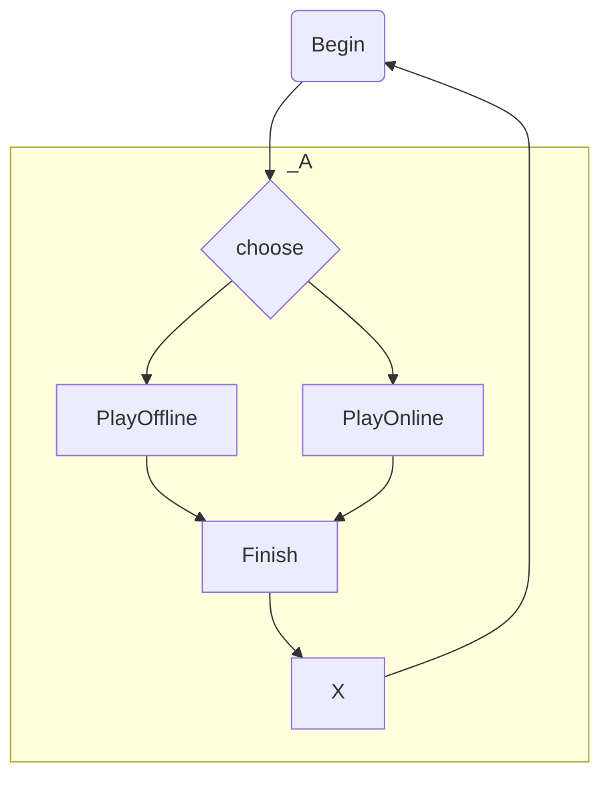

TODO:
    Replicate Yahoo Games System                                                            /:app/:lounge/:room/:seat
        > which app?                                                                        /
        >> [ spades ]
        < spades                                                                            /spades
        > Which lounge?
        >> [ beginners ]
        < beginners                                                                         /spades/beginner
        > What do you want to do ?
        >> [ chat, list-rooms, create-room, join-room, refresh ]
        < join-room                                                                         /spades/beginner/room5
        >> [ sit, invite-robot, start-game, chat ]                                          
        < sit                                                                               /spades/beginner/room5/seat2
        >> +[ stand, invite-robot, start-game, chat ]
        < start-game                                                                        
        >> [ play-card, make-bid, chat, stand-up, leave-room ]
    
    This application will be triggered on ddb updates 
        Load the app state
        Prompt/Send to any terminals
        Save state
        Exit
    
    RoomServiceApp
        name
        description
        terminals

        ~thaw(state:any):RoomServiceApp
        async resume()
        freeze()
    
Loading

Errors

Player1 is to be a WebTerminal also

WebTerminal Resumption
    WebTerminals can re-establish with a terminal they disconnected from after re-starting the application.

WebTerminal Encryption
    WebTerminals will have a property in owner called pubkey
    When the terminal is written to, it is auto-encrypted with the pubkey
    When the terminal is read, it is auto-decrypted with the privkey

    creator: { metadata, time, pubkey, privkey }
    owner: { metadata, time, pubkey, privkey }

Table Service
- The goal is to replicate the systems of Yahoo Systems
- This application can run continously in the cli, or in anyones browser
    - client-hosted: a long-running continuous process requiring on-prem equipment (could be a mobile app)
- This application can also be a serverless trigger ( ie; DDB EventHandler Lambda )
    -- ie; TableServiceApp 
        -- thaw-state, proceed-with-app( input(response) --> process --> output (prompt) ), freeze-state
        await TableServiceApp.resume();

Room { app; terminals:WebTerminal[] }
interface TableServiceApp { name; terminals: WebTerminal[] }

TableService
    has/creates many terminals - of people who want to join a room, and run an app with other people
    has many apps - spades for example
    has many rooms - each room a different app
    the app has many terminals

hawryschuk.com/games
    GET /terminals
        results { } a bunch of TableService terminals
        -- The TableService application will maintain 1 free-terminal creating as needed
    
    POST /terminal/TableService-seat1/owner
        -- Start talking to the table service

> Welcome to TableService, how can I help you?
>> [ list-people, list-rooms, create-room, join-room, send-chat, refresh ]
< join-room
>  Which room?
< abc

< list-rooms
> [ { name, people, seats, seatsFree, app } ]

# @hawryschuk/spades
A software-engineering project implemented with a feature-driven-development architecture, using agile iterations.

0) Features                 ( Start-New-Game, Start-New-Hand, Get-Bids, Play-Book, Detect-Book-Winner, Start-New-Book, Finish-Hand, Prompt-Restart, Robot-Player, Terminal-Interface )
1) Business Model           ( Game o-- |*| Hand & |4| Player o-- |<=13| Card |13| --o Suit , Hand o-- |13| Book o-- |4| Card )
2) Application Flowchart    ( Start-Game, Start-New-Hand, Make Bid, Play 13 Books, Calculate Score, Start-New-Hand | End-Game )
3) Applications
    - Tester                npm test
    - Command-Line          npm run cli                                                 -- game-service , terminal-interaction , player-1:stdin/stdout, player2-4:robot-controlled
    - GUI-CLI               npm run frontend        cd frontend && npm start            -- ui-terminal-component w/ terminal
    - GUI-UI                                                                            -- ui-graphical w/ terminal to player-1
    - GUI-Mirror                                                                        -- ui-graphical constructed from the terminal-log of the second player
    - GUI-UI-3rd-Perspective                                                            -- ui-graphic w/ terminal to player-1
    - Terminal-Service      -- the game runs in one thread, the http-server runs on another thread, and the terminals are shared interally(synchronously) or externally(asynchronously)
    - Terminal-Client       -- client runs over http, which can be used by a cli app and a gui app
    - CLI using Terminal-Client
    - GUI using Terminal-Client

    A Terminal is an object with a screen to display output, and a keyboard to receive input.
        -- terminal has write-access to the screen      : terminal.write() executed by the Game (controller)                        : write('alex, you have the following cards -- a,b,c')                  terminal.free --> terminal.unread
        -- terminal gives read-access to the user       : terminal.read() is executed by the Player by the Players-View-Model       : read() returns 'alex, you have the following cards -- a,b,c'          terminal.unread --> terminal.free
        -- terminal has execute-accesss to prompt       : terminal.prompt() is executed by the Game                                 : prompt('what card do you want to play')                               terminal.free --> terminal.prompted
        -- terminal gives execute-access to the user    : terminal.respond() is executed by the Player                              : respond('a')                                                          terminal.prompted --> terminal.free

    TerminalService {
        name; construct();
    }

    ObjectPool {
        useClass: any;
        getInstance(){}
    }

    TerminalServer => {
        getTerminals():{serviceId,instanceId,terminalId,description,available,owner}[]{}
        getServices(){}
        registerService(ServiceKlass extends TerminalService){}
        claimTerminal(id){}
        respond(terminal)
        getInstance(serviceId){}
    }

    t = new TerminalServer()
        .registerService({ name:'spades', useClass: Spades })
    
## TODO

### Use my AI game-strategy controlling another Android app
    - Start the game in a window ( ie: TeamViewer to view the android screen )
    - Start reading the game-window by screen-capturing
    - Convert raster-image of screen into game-data-structure
    - Apply our game-playing algorithm to choose which card to play
    - Send the click to the game-window

#### Capture Desktop to a PNG file
    ffmpeg -y -f gdigrab -i desktop -r 1 -frames:v 1 out.png