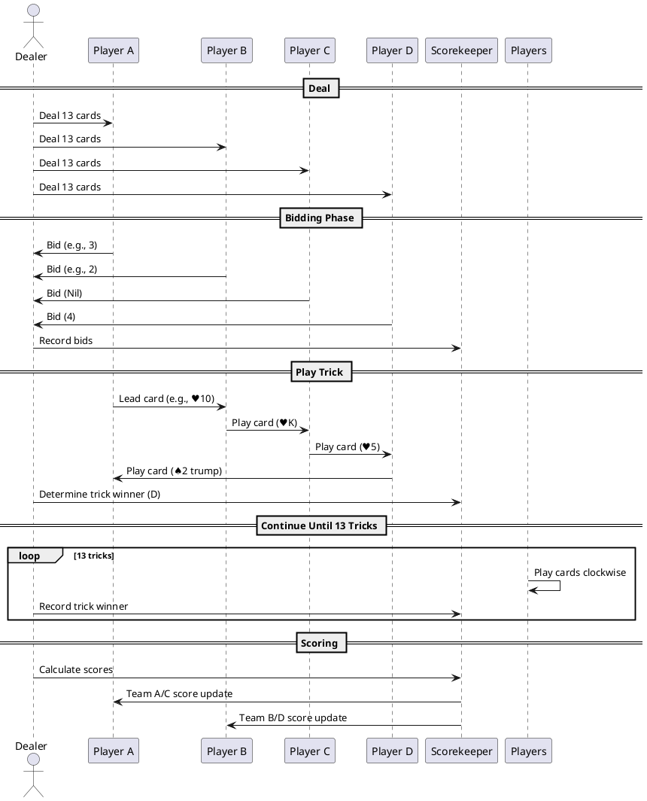

# Spades 
> A card game with four players, made up of teams north-south and east-west.

<a href=sample>Sample GUI</a>

# Sequence Diagram

```plantuml
@startuml
actor Dealer
participant "Player A" as A
participant "Player B" as B
participant "Player C" as C
participant "Player D" as D
participant "Scorekeeper" as S

== Deal ==
Dealer -> A: Deal 13 cards
Dealer -> B: Deal 13 cards
Dealer -> C: Deal 13 cards
Dealer -> D: Deal 13 cards

== Bidding Phase ==
A -> Dealer: Bid (e.g., 3)
B -> Dealer: Bid (e.g., 2)
C -> Dealer: Bid (Nil)
D -> Dealer: Bid (4)
Dealer -> S: Record bids

== Play Trick ==
A -> B: Lead card (e.g., ♥10)
B -> C: Play card (♥K)
C -> D: Play card (♥5)
D -> A: Play card (♠2 trump)
Dealer -> S: Determine trick winner (D)

== Continue Until 13 Tricks ==
loop 13 tricks
  Players -> Players: Play cards clockwise
  Dealer -> S: Record trick winner
end

== Scoring ==
Dealer -> S: Calculate scores
S -> A: Team A/C score update
S -> B: Team B/D score update
@enduml

```