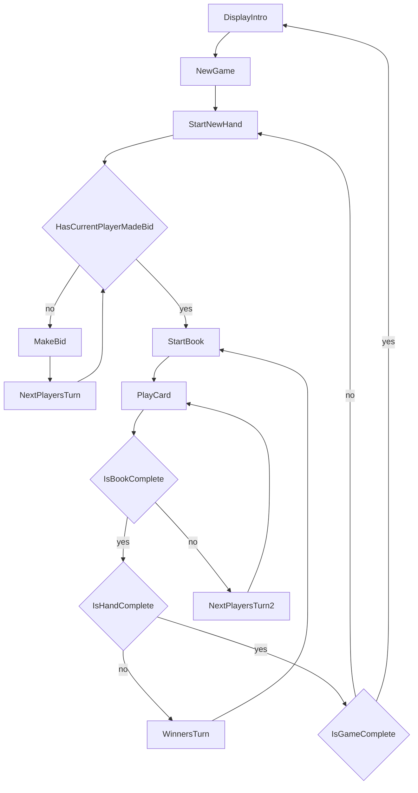
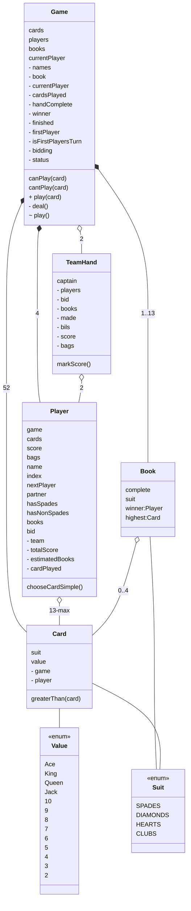

1) Introduction
2) Business Model
3) Game-Play Flowchart                          -- standard communication [stdin stdout stderr] -- activity diagram | graph 
4) Game-Play Features                           -- verify rules of the game [ what can and cannot be played ]
5) Game-Play Tester                             -- initial-programming -- v0.1.0 -- fdd, tdd, ci, cd
6) Application 1: CLI-1-NODE                    -- terminal[bash cmd etc | stdin stdout stderr] <--> terminal-adaptor <--> application
7) Application 2: GUI-1-TERMINAL-COMPONENT      -- web-browser terminal-interface <--terminal-adaptor --> application
8) Application 3: GUI-2-APP                     -- visualized from the game-instance in-memory, responded via the stdin
9) Application 4: GUI-3-TERMINAL-LOG            -- visualized from the playback of a player's terminal's historical log (from a robot player)
10) Application 5: CLI-2 -- TWO-TIER            -- REST-API Server, Terminal-Services Backend, remote terminal (stdin/stdout) running the service instance
11) Application 6: GUI-4 -- TWO-TIER            -- visualized from the playback of a player's terminal's historical log, and terminal-posession to respond (from a human player)
12) Application 7: GUI-5 -- TWO-TIER            -- visualized from the game-instance in-memory, responded to via the memory-terminal by local-human-player-1, and remote-human-player2-web-terminal, and two-robots

1) Terminal-Server                              -- Provides terminals to running applications (instances) for the instance to then share with others to control ( robots or people )
2) Business Model
3) Flowchart
4) Application 8: Express Server
5) Application 9: AWS S3, API Gateway Lambda    -- GET | POST | PUT | DELETE /terminals [/:terminal_id ]          { service, instance, terminal, prompt, response, stdout, stderr }
                        A) Player1 runs the game-instance and synchronizes the other player to a web-terminal
                        B) Each service runs continuous, in an ec2 ( or your own pc ) , sycnrhonizing with the /terminals service
                        C) Each service runs serveless, s3-event-lambda or url-callback, to reconstruct the service-instance and resume playback

    ( SERVER : EXPRESS-LONG-RUNNING-APPLICATION )
    - game state is stored in the object and not-persisted anywhere else    
10) SERVER-CLOUD : AWS & IPFS
    - AWS : Lambda : /services, /terminals      ( we will throw in spades, stock-ticker, and custom )
    - AWS : Lambda : /services/spades
    
# Physical Design
```
    prompts
    @hawryschuk/common
    @hawryschuk/angular-prompts
    @hawryschuk/orm-restapi
    @hawryschuk/cli-restapi
    @hawryschuk/spades
        business-model  (abstract-interactive game runner)
        app-cli         (two-line-app linking game with prompts)
        app-gui-cli     (two-line-app linking game with angular-prompts)
        app-gui         (custom-design which interacts with the interactive-app in the background)
        
        game:
            - nobody in all seats                           - test cards, current turn, canPlay, etc
            - ran by robot-players                          - test game completion
            - ran by human via cli                          * shouldnt need a test
            - ran by human via cli in gui
            - ran by human via mouse                        - test visuals for game state permutations
            - ran by terminal-server                        - ( human>=0 , idle>=1 , robots<=3     )
            - ran by human with terminal-server-client      - ( human>=1 , robots<=2, idle>=0      )
            - ran by 2 remote humans and a remote server    - ( human>=2 , robot<=2                )

        terminals connect with:
            - nobody
            - robots
            - human via cli
            - human via cli-in-gui
            - human via gui
            - gui-cli-stdin-stdout
            - restapi-server

    Node --> prompts --> CliApp (hawryschuk-spades)
    Node --> Typescript --> Angular --> AngularPrompts --> Game
    GUI --> Game
```

BusinessModel

InteractiveGame

CLI_Application 

CLI_to_GUI_Application

GUI_Application interacts 

# Game Play


# Business Model

